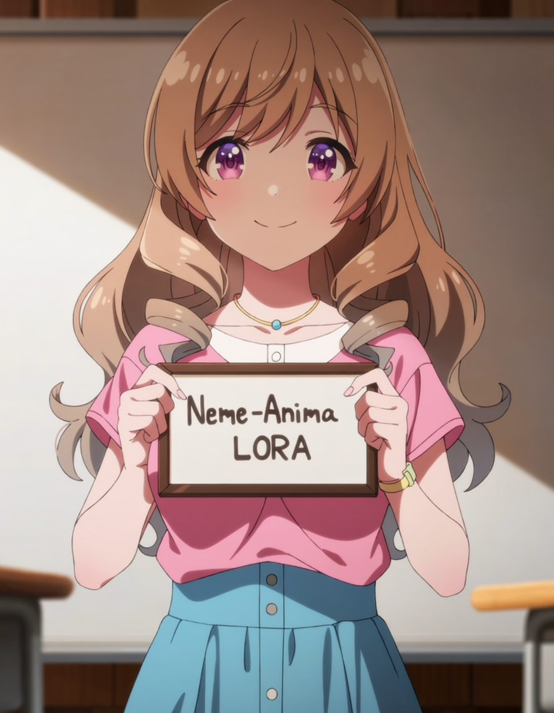
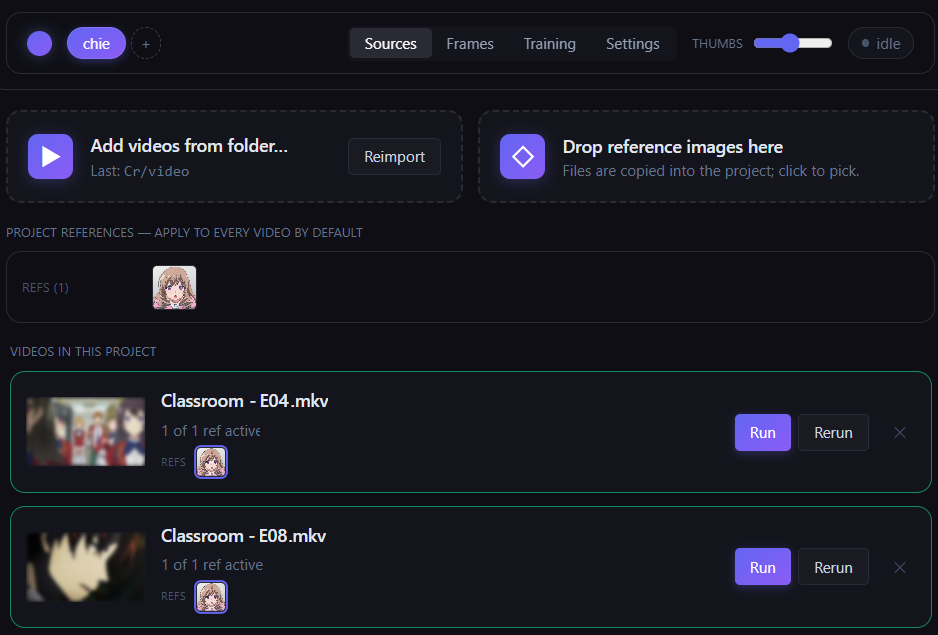
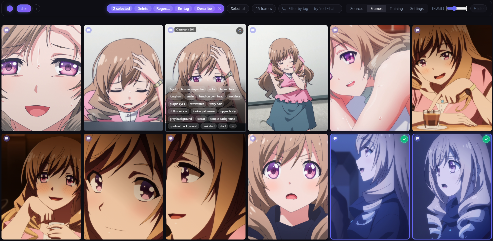
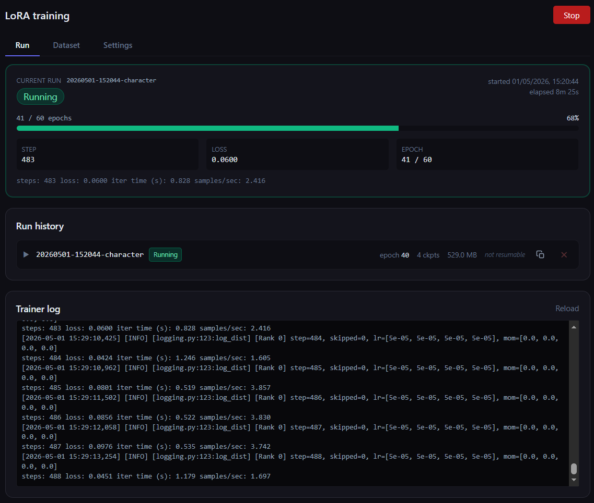

# Neme-Anima

A three-step character LoRA builder:

1. Extract crops of a target character from a video using reference images.
2. Auto-tag each crop with WD14 danbooru tags and natural-language captions, then reorganize the dataset from the UI.
3. Train a LoRA on Anima with the parameters already wired in.

The extractor and tagger are model-agnostic and produce output sized for kohya-ss / OneTrainer / sd-scripts on SDXL-class anime models (Pony, Illustrious, NoobAI, vanilla SDXL). The trainer targets Anima.

<p align="center"></p>

## Pipeline

For each video:

1. PySceneDetect splits it into shots.
2. DeepGHS YOLO (via `imgutils`) detects characters per frame.
3. ByteTrack links detections into per-shot tracklets.
4. CCIP matches tracklets to your reference images.
5. 1–3 frames per kept tracklet are picked by sharpness, visibility, and aspect ratio.
6. Each pick is cropped at longest-side 1024 with the original background.
7. WD14 EVA02-Large v3 writes a kohya-style `.txt` next to each `.png`.

Detections and tracklets are cached so threshold re-runs skip the slow stages.

## Requirements

For the extractor/tagger:

- NVIDIA GPU, 4 GB VRAM minimum, 8 GB comfortable

For the trainer:

- Linux / WSL2 with CUDA 12.4+
- NVIDIA GPU, 6 GB VRAM minimum, 16 GB for full res LoRA

## Install

```sh
uv sync --group gpu
```

First run downloads ~2.8 GB of weights (anime YOLOv8 person + face, CCIP, isnetis/anime-seg, WD14 with embeddings, CLIP base) to `~/.cache/huggingface/hub/`.

Override the cache location:

```sh
HF_HUB_CACHE=/mnt/c/Users/<you>/.cache/huggingface/hub uv run neme-anima project extract ...
```

## CLI

```sh
uv run neme-anima project create ~/neme-projects/megumin --name megumin
uv run neme-anima project add-ref ~/neme-projects/megumin /path/to/portrait.png
uv run neme-anima project add-video ~/neme-projects/megumin /path/to/ep01.mkv
uv run neme-anima project add-video ~/neme-projects/megumin /path/to/ep02.mkv
uv run neme-anima project extract ~/neme-projects/megumin
```

Project folder layout:

```
~/neme-projects/megumin/
  project.json
  refs/
  output/
    kept/             ep01__s003_t012_f000847.png + .txt
    rejected/
    metadata.jsonl
    cache/<stem>/     scenes.parquet, tracklets.parquet
```

Re-run with new thresholds (skips detection + tracking):

```sh
uv run neme-anima project rerun ~/neme-projects/megumin --video ep01
```

## Web UI

After cloning the repository:

```sh
cd frontend && npm install && npm run build && cd ..
```

Then start the server:

```sh
uv run neme-anima ui
```

Binds to `127.0.0.1:<random-port>` and opens the SPA. Tabs: Sources, Frames, Training, Settings.

### Sources

Add MKV/MP4 videos and reference images, opt out of refs per video, run extraction.



### Frames

- Add or remove images from the dataset (using drag&drop).
- Edit tags inline by clicking a pill; edit the natural-language description in the same panel.
- Search across the dataset by tag.
- Bulk-edit tags with regex replace, with live preview.
- Re-crop any image.

Selection: shift-click ranges, ctrl-click multi-toggle, `A` select all, `D` / `Esc` deselect. Hover a thumbnail for the tag overlay.



### Training

LoRA training with stop/resume and checkpoint retention. Targets Anima.



Training is run through [tdrussell/diffusion-pipe](https://github.com/tdrussell/diffusion-pipe), which has to be set up separately:

```sh
git clone https://github.com/tdrussell/diffusion-pipe ~/diffusion-pipe
cd ~/diffusion-pipe && uv venv && uv pip install -r requirements.txt
```

Then in the Settings tab, point `diffusion_pipe_dir` at that clone and set the Anima DiT, Qwen VAE, and Qwen 3 0.6B text encoder paths (separate download on Huggingface).

### Settings

Per-project threshold overrides (frame stride, identification distance, crop padding, etc.).

Project state lives in the project folder. The only server-side file is `~/.neme-anima/db.sqlite` (project registry).
